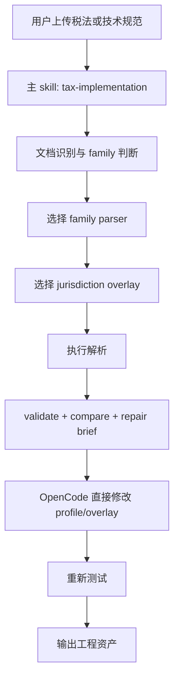
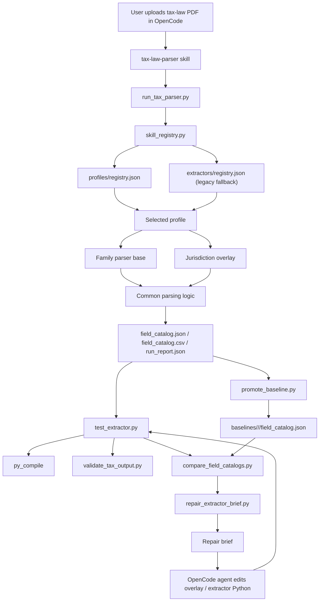

# 全球税法实施层设计方案 v1

## 1. 文档目的

本文档只讨论“实施层”如何设计，不讨论研究层问答产品，也不讨论最终业务运行时。

这里的“实施层”指的是：

- 输入官方税法、技术规范、电子发票规范、报文字段定义、代码表
- 输出工程可用的结构化资产
- 帮助 AI 和工程人员持续维护 parser / extractor / mapping

本文档回答三个核心问题：

1. 应该是一个 skill 还是多个 skill
2. 应该是一个 parser 还是多个 parser
3. 这个 skill 工程到底应该怎么做

## 2. 结论

当前阶段建议采用：

- **一个主 skill**
- **一个 parser framework**
- **多个 family parser**
- **多个 jurisdiction overlay**

即：

**1 个 skill，对外单入口；1 套 parser framework，对内多家族；国家差异放 overlay。**

## 3. 为什么现在只做一个主 skill

### 3.1 原因

实施层当前的核心动作，本质上还是同一类：

- 识别输入文档属于哪个家族
- 选择已有 parser profile
- 执行解析
- 校验结构
- 和 baseline 做 diff
- 产出 repair brief
- 修改 extractor / overlay

这些动作不应该被拆成多个用户入口，否则会出现以下问题：

- 用户不知道该叫哪个 skill
- agent 需要先判断 skill，再判断 parser
- skill 间上下文切换过多
- 工程资产被分散，后续维护困难

### 3.2 当前推荐形态

当前推荐只保留一个主 skill，例如：

- `tax-implementation`

或者继续沿用：

- `tax-law-parser`

名字不是重点，重点是：

- 对外单入口
- 对内分层组织

## 4. 为什么不能只有一个全球 parser

### 4.1 现实问题

全球税法和电子发票规范看起来都像“字段解析”，但输入结构差异巨大：

- 有些是 PDF 表格
- 有些是 HTML 规范
- 有些是 XSD / schema-first
- 有些是 Excel 代码表
- 有些是 API 文档
- 有些是清分/清算平台文档

如果强行做成一个“全球通用 parser”，会出现：

- 逻辑越来越脆
- heuristics 越来越多
- 每次修一个国家，别的国家可能受影响
- 无法清晰定位问题属于哪类文档

### 4.2 结论

不能只有一个 parser。

正确做法是：

- 一套 parser framework
- 多个 family parser

## 5. 为什么也不能一个国家一个完全独立 parser

### 5.1 现实问题

如果每个国家都单独做一整套 parser，会很快爆炸。

因为很多国家共享大量共性：

- EN16931 core
- UBL 路径
- Peppol / PINT 衍生模式
- 表格化字段定义
- “字段行 + 路径行”的文档结构
- 本地扩展字段 + 本地规则的叠加方式

### 5.2 代价

如果一个国家一个独立 parser，会导致：

- 重复代码很多
- 测试资产无法复用
- parser 修复经验无法迁移
- 维护成本随国家数线性上升

### 5.3 结论

不能“一个国家一个独立 parser”。

正确做法是：

- 共性进 `family parser`
- 差异进 `overlay`

## 6. 推荐总体架构



### 6.1 当前 implementation skill 架构图

下面这张图描述的是当前已经落地的 skill 分层，而不是抽象理想图。



### 6.2 图的含义

这张图体现了几个当前实现已经遵守的原则：

- OpenCode agent 负责修改 Python parser / overlay
- skill 脚本只负责执行、校验、对比、诊断
- `profiles/registry.json` 是主路径，`extractors/registry.json` 只做兼容
- `family parser base` 放共性逻辑，`overlay` 放国家差异
- baseline 是 skill 自带资产，不再依赖外部 artifact 路径

## 7. skill 工程分层

### 7.1 顶层原则

skill 工程必须分成三层：

1. **Workflow 层**
   说明 OpenCode 遇到任务时该怎么走

2. **Tooling 层**
   脚本，只负责执行和诊断

3. **Profile 层**
   真正的 parser / overlay 实现

### 7.2 推荐目录

```text
.opencode/skills/tax-implementation/
  SKILL.md
  references/
    canonical-model.md
    workflow.md
    parser-families.md
    overlays.md
    repair-brief.md
    families/
      en16931-ubl.md
      peppol-pint.md
      schema-first.md
      clearance-html.md
  scripts/
    run_parser.py
    validate_catalog.py
    compare_catalogs.py
    test_profile.py
    build_repair_brief.py
    bootstrap_profile.py
  profiles/
    registry.json
    families/
      en16931_ubl/
        base.py
        hr_overlay.py
        rs_overlay.py
      peppol_pint/
        base.py
      schema_first/
        base.py
      clearance_html/
        base.py
  baselines/
    hr/
    rs/
    peppol/
  examples/
```

## 8. 一个主 skill 应该怎么写

### 8.1 `SKILL.md` 只放什么

`SKILL.md` 只放：

- 这个 skill 是干什么的
- 什么时候用
- 主工作流
- 哪些脚本负责执行
- 哪些 profile 负责解析
- 如果结果不对，怎么走 repair brief

不要把国家细节、标准细节全部塞进 `SKILL.md`。

### 8.2 变体内容放哪里

具体 family 差异放到：

- `references/families/*.md`

国家 overlay 规则放到：

- `profiles/families/<family>/*_overlay.py`

这符合 skill 的 progressive disclosure 原则。

## 9. parser framework 怎么拆

### 9.1 Framework 的职责

framework 负责：

- 输入适配
- profile 路由
- 输出归一化
- 测试、diff、repair brief

framework 不负责：

- 每个国家的所有细节
- 全部标准知识
- 法律解释

### 9.2 family parser 的职责

family parser 负责：

- 该类文档的核心结构提取逻辑
- 表头识别
- 路径行识别
- 行合并和跨页处理
- 基础字段组装

### 9.3 overlay 的职责

overlay 负责：

- 本地表头语言差异
- 本地特殊路径规则
- 本地必填/禁用字段
- 本地 note / code list 解析
- 本地修复 heuristics

## 10. 推荐的 family parser 划分

当前建议至少做 4 类：

### 10.1 `en16931_ubl_table_family`

适用于：

- EN16931 风格表格 PDF
- 以 `BT-* / BG-* / BR-*` 为核心
- UBL 路径直接出现在表格中
- 多个欧洲及其本地扩展国家

当前 Croatia、Serbia 这类应优先落在这个 family。

### 10.2 `peppol_pint_family`

适用于：

- Peppol PINT / BIS 风格
- 国际互操作 profile
- 和 EN16931 有重叠，但语义包装和 profile 规则不同

### 10.3 `schema_first_family`

适用于：

- XSD / JSON Schema / API schema 优先
- PDF 只是说明，schema 才是真正结构来源

### 10.4 `clearance_html_family`

适用于：

- 平台化网页规范
- clearance / CTC 接口文档
- 页面结构强于表格结构

## 11. overlay 怎么设计

### 11.1 overlay 不是 fork

overlay 不应该复制一整份 base parser。

overlay 应该只定义：

- 语言特征
- 表头模式
- 路径修正规则
- 特殊字段修正
- 代码表和 note 处理规则

### 11.2 推荐结构

例如：

```text
profiles/families/en16931_ubl/
  base.py
  hr_overlay.py
  rs_overlay.py
```

其中：

- `base.py` 放通用行识别、字段拼装、路径合并
- `hr_overlay.py` 放 HR 特定规则
- `rs_overlay.py` 放 SRBDT 特定规则

### 11.3 overlay 必须可测试

每个 overlay 都必须有：

- 至少一份输入样本
- 至少一份输出 baseline
- 至少一条 `test_profile.py` 路径

## 12. registry 怎么做

### 12.1 registry 的作用

registry 是 skill 的路由层。

它负责把输入文件映射到：

- 哪个 family
- 哪个 profile / overlay

### 12.2 推荐字段

每个 registry entry 至少包含：

- `name`
- `family`
- `module`
- `description`
- `filename_contains`
- `text_contains`
- `document_language`
- `jurisdiction`
- `tax_domain`

### 12.3 为什么要有 family 字段

因为后面 repair brief 和 bootstrap 不应该只知道“某个 extractor 名称”，还要知道：

- 它属于哪类 parser
- 应该继承哪个 base
- 应该读取哪类 reference

## 13. 脚本层怎么做

### 13.1 只保留执行和诊断

脚本层建议只保留以下职责：

- `run_parser.py`
- `validate_catalog.py`
- `compare_catalogs.py`
- `test_profile.py`
- `build_repair_brief.py`
- `bootstrap_profile.py`

不应在主路径保留：

- 脚本直接调模型生成 profile
- 脚本直接调模型修复 profile

### 13.2 repair brief 的作用

repair brief 应该输出：

- compile / run / validate / compare 结果
- 结构质量指标
- 典型错误样本
- 修复优先级建议

然后让 OpenCode agent 直接改 profile。

## 14. baseline / diff / brief 三件套

### 14.1 baseline

baseline 是实施层最重要的真值资产之一。

建议按以下维度管理：

- `jurisdiction`
- `document_family`
- `version`
- `effective_date`

### 14.2 diff

diff 主要回答：

- 新版文档新增了哪些字段
- 删掉了哪些字段
- 哪些字段定义变化了

### 14.3 brief

brief 主要回答：

- parser 为什么不对
- 优先先修哪一类错误
- 具体有哪些异常样本

## 15. AI 在实施层里的正确位置

AI 在实施层里应该负责：

- 识别 family
- 读 brief
- 修改 profile / overlay
- 解释 diff

AI 不应该在实施层里直接负责：

- 脚本内自动生成代码
- 脚本内自动修复代码
- 最终真值判定

## 16. 当前阶段建议

### 16.1 现在立刻应该做的

1. 把当前 `tax-law-parser` 升级为 implementation-oriented 结构
2. 明确 family parser 概念
3. 把 Croatia 和 Serbia 收敛到同一个 `en16931_ubl_table_family`
4. 给 registry 增加 `family` 字段
5. 让 repair brief 输出统一结构

### 16.2 现在不建议做的

- 一开始拆多个 skill
- 一开始支持所有国家
- 一开始支持所有税种
- 一开始做全自动脚本级修复

## 17. 推荐演进路线

### Phase 1

- 一个主 skill
- 一个 parser framework
- 一个成熟 family：`en16931_ubl_table_family`
- 两到三个国家 overlay
- baseline / diff / brief 跑通

### Phase 2

- 增加 `peppol_pint_family`
- 增加更多 overlay
- 增加回归样本集

### Phase 3

- 增加 `schema_first_family`
- 形成更标准的 canonical model 输出

### Phase 4

- 当研究层和实施层明显分化后，再拆 skill：
  - `tax-research`
  - `tax-implementation`
  - `tax-runtime-mapping`

## 18. 最终建议

如果只给一句落地建议，就是：

**现在不要做多个 skill，不要做一个全球 parser，也不要做一个国家一个 parser。**

应该做的是：

**一个主 skill + 一个 parser framework + 多个 family parser + 多个 jurisdiction overlay。**

这条路线既能支撑全球扩张，又不会让工程在国家数增长后失控。
