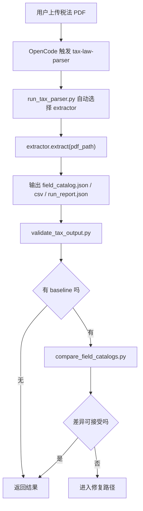
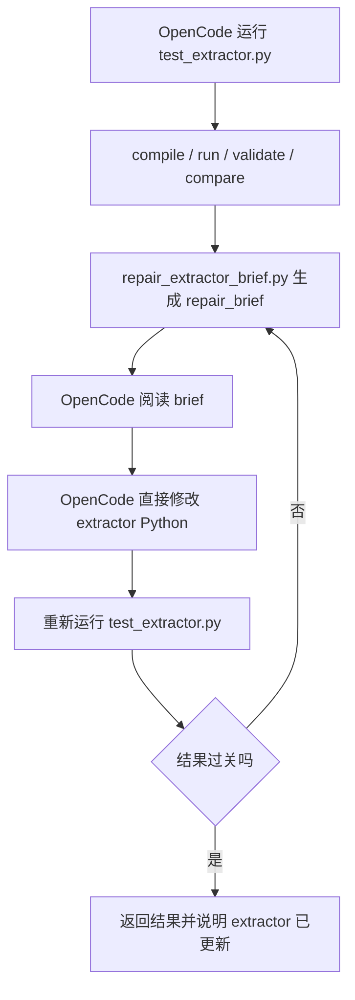

# OpenCode 税法解析 Skill 设计方案 v1

## 1. 目标

本文档定义当前仓库中 `tax-law-parser` skill 的正式方案，目标是让 OpenCode 在本地桌面工作流中稳定处理税法 PDF 更新。

本方案解决两类问题：

1. 已知文档族的小版本更新  
   PDF 格式基本不变，只是字段内容、页码、规则文本、示例值发生变化。

2. 新文档族或大幅改版  
   PDF 表格结构、标题分布、路径行位置、规则块布局发生明显变化，旧 extractor 不再适用。

本方案不再以 Web 应用为主，不再以脚本内嵌 LLM 调用为主，而是以 OpenCode + skill + Python extractor 为主。

## 2. 设计原则

### 2.1 核心原则

- 用户只需要上传文件并在对话里下指令。
- OpenCode agent 直接修改 skill 内的 Python extractor。
- 脚本只负责执行、校验、对比、诊断。
- 脚本主路径不得直接调用模型接口。
- 已验证的 extractor 不应被新文档直接覆盖。
- 诊断必须落地成可复查文件，而不是只停留在对话里。

### 2.2 关键边界

本方案明确禁止以下主路径设计：

- 税法文件一变，脚本自己调 LLM 生成 extractor
- 脚本自己调 LLM 迭代修复 extractor
- 用户需要手动配置仓库路径、虚拟环境或模型参数才能正常使用 skill

本方案允许以下行为：

- OpenCode agent 读取附件 PDF
- OpenCode agent 读取测试和 diff 产物
- OpenCode agent 直接编辑 extractor Python 文件
- 脚本产出结构化 repair brief，供 agent 修代码时使用

## 3. 方案总览

### 3.1 运行载体

- 运行载体：OpenCode 桌面应用
- 能力封装：本地 skill
- 解析实现：Python 脚本 + extractor 模块
- 输入：用户上传的税法 PDF
- 输出：字段目录 JSON/CSV、运行报告、diff、repair brief

### 3.2 当前 skill 目录

当前 skill 位于：

- [`.opencode/skills/tax-law-parser`](/Users/xueyunsong/Documents/GitHub/gec-ai/.opencode/skills/tax-law-parser)

主要文件：

- Skill 入口说明：
  - [`SKILL.md`](/Users/xueyunsong/Documents/GitHub/gec-ai/.opencode/skills/tax-law-parser/SKILL.md)
- 解析主入口：
  - [`run_tax_parser.py`](/Users/xueyunsong/Documents/GitHub/gec-ai/.opencode/skills/tax-law-parser/scripts/run_tax_parser.py)
- 输出校验：
  - [`validate_tax_output.py`](/Users/xueyunsong/Documents/GitHub/gec-ai/.opencode/skills/tax-law-parser/scripts/validate_tax_output.py)
- baseline 对比：
  - [`compare_field_catalogs.py`](/Users/xueyunsong/Documents/GitHub/gec-ai/.opencode/skills/tax-law-parser/scripts/compare_field_catalogs.py)
- 一键总测：
  - [`test_extractor.py`](/Users/xueyunsong/Documents/GitHub/gec-ai/.opencode/skills/tax-law-parser/scripts/test_extractor.py)
- 诊断 brief：
  - [`repair_extractor_brief.py`](/Users/xueyunsong/Documents/GitHub/gec-ai/.opencode/skills/tax-law-parser/scripts/repair_extractor_brief.py)
- extractor 注册表：
  - [`registry.json`](/Users/xueyunsong/Documents/GitHub/gec-ai/.opencode/skills/tax-law-parser/extractors/registry.json)
- extractor 模板：
  - [`template_generic.py`](/Users/xueyunsong/Documents/GitHub/gec-ai/.opencode/skills/tax-law-parser/extractors/template_generic.py)
- 当前稳定 extractor：
  - [`hr_einvoice_legacy.py`](/Users/xueyunsong/Documents/GitHub/gec-ai/.opencode/skills/tax-law-parser/extractors/hr_einvoice_legacy.py)

## 4. 角色分工

### 4.1 OpenCode agent 负责

- 读取用户上传的 PDF
- 判断当前 extractor 是否仍适用
- 运行本地脚本
- 阅读 `run_report / diff / repair_brief`
- 直接编辑 extractor Python
- 重复测试直到结果满足要求

### 4.2 Python 脚本负责

- 选择 extractor
- 执行 PDF 解析
- 归一化字段输出
- 校验 JSON 结构
- 与 baseline 做差异对比
- 产出修复诊断 brief

### 4.3 用户负责

- 上传税法 PDF
- 触发任务
- 在必要时确认最终结果是否可接受

## 5. 主工作流

### 5.1 正常解析路径

当 PDF 仍属于已知文档族时，走以下流程：

### 5.2 修复路径

当 extractor 跑出来结果明显不对时，走以下流程：

### 5.3 新文档族路径

当没有任何 extractor 匹配当前 PDF 时：

1. 运行 [`bootstrap_extractor.py`](/Users/xueyunsong/Documents/GitHub/gec-ai/.opencode/skills/tax-law-parser/scripts/bootstrap_extractor.py)
2. 生成新的 extractor 文件
3. 在 [`registry.json`](/Users/xueyunsong/Documents/GitHub/gec-ai/.opencode/skills/tax-law-parser/extractors/registry.json) 注册 hint
4. OpenCode 直接完善这个新 extractor
5. 运行 `test_extractor.py`
6. 如仍异常，再跑 `repair_extractor_brief.py`

## 6. 自动选择 extractor 机制

### 6.1 注册表来源

自动选择依赖：

- [`registry.json`](/Users/xueyunsong/Documents/GitHub/gec-ai/.opencode/skills/tax-law-parser/extractors/registry.json)

每个 extractor 条目至少包含：

- `name`
- `module`
- `description`
- `filename_contains`
- `text_contains`

### 6.2 选择策略

[`run_tax_parser.py`](/Users/xueyunsong/Documents/GitHub/gec-ai/.opencode/skills/tax-law-parser/scripts/run_tax_parser.py) 会：

1. 读取 PDF 文件名
2. 读取 PDF 前几页文本摘要
3. 根据文件名命中和文本命中打分
4. 选取得分最高的 extractor
5. 如果没有命中，则报错并提示用 [`bootstrap_extractor.py`](/Users/xueyunsong/Documents/GitHub/gec-ai/.opencode/skills/tax-law-parser/scripts/bootstrap_extractor.py) 创建新 extractor

这一层只做模板路由，不做语义理解。

## 7. 输出合同

每条字段记录必须满足统一结构，当前以 skill 输出合同为准。

必需字段包括：

- `field_id`
- `field_name`
- `field_description`
- `note_on_use`
- `data_type`
- `cardinality`
- `invoice_path`
- `credit_note_path`
- `report_path`
- `sample_value`
- `value_set`
- `interpretation`
- `rules`
- `source_pages`
- `min_char_length`
- `max_char_length`
- `min_decimal_precision`
- `max_decimal_precision`
- `extractor_name`

结果主要写到：

- `field_catalog.json`
- `field_catalog.csv`
- `run_report.json`

## 8. 测试与诊断体系

### 8.1 `test_extractor.py`

[`test_extractor.py`](/Users/xueyunsong/Documents/GitHub/gec-ai/.opencode/skills/tax-law-parser/scripts/test_extractor.py) 是主测试入口。

它顺序执行：

1. `py_compile`
2. `run_tax_parser.py`
3. `validate_tax_output.py`
4. `compare_field_catalogs.py`，如果传入 baseline

它负责回答两个问题：

- 代码能不能跑
- 输出结构是不是合法

它还不能单独回答：

- 输出语义是否可信
- 字段拆分是否过于贪婪
- 是否把目录或路径行误抽成字段

### 8.2 `compare_field_catalogs.py`

[`compare_field_catalogs.py`](/Users/xueyunsong/Documents/GitHub/gec-ai/.opencode/skills/tax-law-parser/scripts/compare_field_catalogs.py) 负责：

- 按 `field_id` 建索引
- 输出 `missing`
- 输出 `extra`
- 输出 `changed`

产物：

- `catalog_diff.json`
- `catalog_diff.md`

这是“有 baseline 时”的主要质量闸门。

### 8.3 `repair_extractor_brief.py`

[`repair_extractor_brief.py`](/Users/xueyunsong/Documents/GitHub/gec-ai/.opencode/skills/tax-law-parser/scripts/repair_extractor_brief.py) 是本方案的核心诊断脚本。

它会：

1. 运行 `test_extractor.py`
2. 读取 `field_catalog.json`
3. 读取 `catalog_diff.json`，如果存在
4. 计算质量指标
5. 产出 `repair_brief.json` 和 `repair_brief.md`

### 8.4 当前诊断维度

当前 brief 至少检测以下问题：

- `missing_output`
- `field_name_toc_noise`
- `group_ids_emitted_as_fields`
- `rule_ids_used_as_report_path`
- `missing_paths`
- `missing_names`
- `missing_descriptions`

### 8.5 当前质量指标

当前 brief 至少输出以下指标：

- `record_count`
- `empty_name_ratio`
- `empty_description_ratio`
- `group_id_ratio`
- `leader_dots_name_ratio`
- `report_path_rule_ratio`
- `path_coverage_ratio`

### 8.6 brief 的定位

repair brief 是诊断工具，不是修复工具。

它的定位是：

- 给 OpenCode agent 明确证据
- 给 OpenCode agent 明确修复优先级
- 减少 agent 盲改 extractor 的成本

它不做以下事情：

- 不调模型
- 不改 Python 文件
- 不自动迭代

## 9. 为什么禁止脚本内嵌 LLM 调用

本方案明确不把“脚本自己调模型生成或修复代码”作为主路径，原因如下：

1. OpenCode 本身已有模型能力  
   再在脚本里套一层模型调用，会导致职责重复。

2. 可调试性差  
   用户难以看清到底是 OpenCode agent 改了代码，还是脚本内部偷偷改了代码。

3. 故障面变大  
   一旦脚本里嵌模型调用，就会引入额外的环境变量、网络、超时、格式清洗、返回结构兼容问题。

4. 难以形成清晰边界  
   “脚本负责执行，agent 负责改代码”是最容易长期维护的边界。

因此，当前方案只保留：

- agent 层的智能
- 脚本层的执行和诊断

## 10. OpenCode 实际使用方式

### 10.1 正常解析

用户在 OpenCode 中上传 PDF 后，推荐话术：

`用 tax-law-parser 解析这个税法文件，先复用现有 extractor，跑完测试后告诉我结果路径。`

### 10.2 结果不对时

推荐话术：

`这个结果不对。用 tax-law-parser 跑 repair brief，按 brief 直接修改 extractor，再重新测试。`

### 10.3 新格式 PDF

推荐话术：

`这个 PDF 是新格式。用 tax-law-parser 新建 extractor，更新 registry，然后跑完整测试链。`

## 11. 当前已验证内容

### 11.1 稳定 extractor 验证

已验证：

- [`hr_einvoice_legacy.py`](/Users/xueyunsong/Documents/GitHub/gec-ai/.opencode/skills/tax-law-parser/extractors/hr_einvoice_legacy.py)

已验证通过：

- `compile`
- `run`
- `validate`
- `compare`

### 11.2 repair brief 验证

已对以下样本运行 repair brief：

- [`hr_ai_generated_smoke.py`](/Users/xueyunsong/Documents/GitHub/gec-ai/.opencode/skills/tax-law-parser/extractors/hr_ai_generated_smoke.py)

产物示例：

- [`repair_brief.json`](/Users/xueyunsong/Documents/GitHub/gec-ai/artifacts/tax-skill/repair-brief-smoke/repair_brief.json)
- [`repair_brief.md`](/Users/xueyunsong/Documents/GitHub/gec-ai/artifacts/tax-skill/repair-brief-smoke/repair_brief.md)

这次诊断识别出：

- `extra = 15`
- `changed = 174`
- 主要问题集中在路径丢失、名称与描述混叠、行抽取过于贪婪

这说明 brief 机制已能在无脚本级模型调用的前提下输出有效修复证据。

## 12. 当前局限

### 12.1 仍依赖 baseline

当存在可信 baseline 时，质量判断最稳。  
没有 baseline 时，只能依赖结构指标和启发式诊断。

### 12.2 语义正确性仍需 agent 最终把关

即使：

- `compile = ok`
- `validate = ok`
- `compare` 差异下降

也不等于字段语义一定完全正确。  
OpenCode 仍需要检查变化样本和路径恢复质量。

### 12.3 extractor 仍是文档族定制代码

当前方案没有追求“一个超通用 parser 通吃所有税法 PDF”。  
现实上，更稳的路线是：

- 一个文档族一个 extractor
- 新文档族新增 extractor
- 通过 registry 做路由

## 13. 后续演进方向

### 13.1 短期

- 为 repair brief 增加更多结构指标
- 增加“字段名过长”“description 含路径污染”“data_type 异常值”检测
- 为 `test_extractor.py` 增加阈值模式，方便做 gate

### 13.2 中期

- 把不同国家/税种拆成更多 extractor family
- 为不同文档族建立稳定 baseline 集
- 增加回归测试样本目录

### 13.3 长期

- 从“单 PDF 提取”演进为“同一文档族多版本回归”
- 将 repair brief 进一步结构化，便于 agent 更快定位修复范围
- 形成可复用的 extractor 开发规范

## 14. 结论

当前 v1 方案已经明确了最重要的工程边界：

- OpenCode agent 负责理解和改代码
- Python 脚本负责执行和诊断
- skill 主路径不再包含脚本级模型调用

这让整套系统既保留了 AI 处理新税法格式变化的能力，也保持了足够强的可调试性和可维护性。
