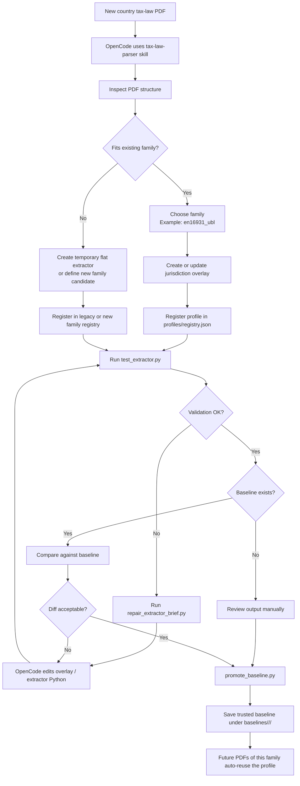

# Tax Skill Family + Overlay 迁移方案 v1

## 1. 文档目的

本文档定义如何把当前的：

- [`.opencode/skills/tax-law-parser`](/Users/xueyunsong/Documents/GitHub/gec-ai/.opencode/skills/tax-law-parser)

从“单层 extractor 列表”迁移到：

- `family parser + jurisdiction overlay`

目标不是立刻重写全部代码，而是给出一份可以分阶段落地的改造清单。

## 2. 当前状态

### 2.1 当前 skill 结构

当前主要结构如下：

```text
.opencode/skills/tax-law-parser/
  SKILL.md
  extractors/
    registry.json
    hr_einvoice_legacy.py
    hr_ai_generated_smoke.py
    rs_srbdt_ext_2025.py
    template_generic.py
  scripts/
    run_tax_parser.py
    validate_tax_output.py
    compare_field_catalogs.py
    test_extractor.py
    repair_extractor_brief.py
    bootstrap_extractor.py
```

### 2.2 当前优点

- 已有单入口 skill
- 已有执行、校验、diff、brief 四件套
- 已有多个国家样本
- 已有 registry 路由
- 已证明 OpenCode 可以直接用附件驱动 skill

### 2.3 当前问题

当前结构最大的问题不是“不能用”，而是“后面扩国家会失控”。

主要问题：

1. `extractors/` 是平铺的  
   现在所有 parser 都直接放在同一层，无法表达 family 关系。

2. `registry.json` 不知道 family  
   现在只能路由到某个 module，不能知道它属于哪一类 parser。

3. 共性逻辑没有抽到 base  
   Croatia 和 Serbia 都在做 EN16931 / UBL 表格解析，但没有统一 `base.py`。

4. overlay 概念不存在  
   国家差异目前只能写成一个完整 extractor 文件。

5. `bootstrap_extractor.py` 还是平铺思维  
   它现在生成的是一个独立 extractor，不是 family 下的 overlay。

## 3. 迁移目标

### 3.1 目标结构

```text
.opencode/skills/tax-implementation/
  SKILL.md
  references/
    workflow.md
    parser-families.md
    overlays.md
    repair-brief.md
    families/
      en16931-ubl.md
      peppol-pint.md
      schema-first.md
  scripts/
    run_parser.py
    validate_catalog.py
    compare_catalogs.py
    test_profile.py
    build_repair_brief.py
    bootstrap_profile.py
  profiles/
    registry.json
    families/
      en16931_ubl/
        base.py
        hr_overlay.py
        rs_overlay.py
      peppol_pint/
        base.py
      schema_first/
        base.py
  baselines/
    hr/
    rs/
  examples/
```

### 3.2 最重要的设计变化

迁移后不再是：

- 一个国家一个独立 extractor 文件

而是：

- family 放共性
- overlay 放国家差异

## 4. 迁移原则

### 4.1 不做大爆炸重写

迁移必须分阶段完成，不能一次性推翻当前 skill。

### 4.2 先兼容，后升级

在迁移早期，旧入口仍然可用，避免把当前已能跑的能力打断。

### 4.3 先抽共性最多的 family

当前最值得先落的是：

- `en16931_ubl_table_family`

因为：

- Croatia 和 Serbia 已经证明属于同一大类
- 当前已有两个国家样本
- 复用收益最高

## 5. 第一阶段目标

### 5.1 阶段目标

第一阶段不改 skill 名字，不改用户入口，只做内部结构升级。

也就是说，先保留：

- `tax-law-parser`

但把内部逐步演进成 family + overlay。

### 5.2 第一阶段只做一类 family

只先引入：

- `en16931_ubl`

不要第一阶段就上：

- `peppol_pint`
- `schema_first`
- `clearance_html`

否则工程面太散。

### 5.3 新国家接入流程图

下面这张图描述的是当前推荐的新国家接入路径。重点不是“自动生成一切”，而是“先判断 family，再决定是加 overlay 还是临时 flat extractor”。



## 6. 第一阶段目录改造

### 6.1 新增目录

建议新增：

```text
.opencode/skills/tax-law-parser/
  references/
    parser-families.md
    overlays.md
    repair-brief.md
    families/
      en16931-ubl.md
  profiles/
    registry.json
    families/
      en16931_ubl/
        __init__.py
        base.py
        hr_overlay.py
        rs_overlay.py
        template_overlay.py
  baselines/
    hr/
    rs/
```

### 6.2 旧目录保留但逐步废弃

短期内保留：

- `extractors/`

但逐步把其角色降为兼容层。

未来状态：

- `extractors/` 只保留兼容 wrapper
- 真正实现迁到 `profiles/families/`

## 7. 文件映射方案

### 7.1 Croatia

当前：

- [`hr_einvoice_legacy.py`](/Users/xueyunsong/Documents/GitHub/gec-ai/.opencode/skills/tax-law-parser/extractors/hr_einvoice_legacy.py)

迁移后：

- [`profiles/families/en16931_ubl/hr_overlay.py`](/Users/xueyunsong/Documents/GitHub/gec-ai/.opencode/skills/tax-law-parser)

注意：

- 由于当前 HR 还是调用已有项目脚本，所以第一阶段可以保留 wrapper 形式
- 即 overlay 可以先只是代理到 `scripts.extract_tax_fields`

### 7.2 Serbia

当前：

- [`rs_srbdt_ext_2025.py`](/Users/xueyunsong/Documents/GitHub/gec-ai/.opencode/skills/tax-law-parser/extractors/rs_srbdt_ext_2025.py)

迁移后：

- [`profiles/families/en16931_ubl/rs_overlay.py`](/Users/xueyunsong/Documents/GitHub/gec-ai/.opencode/skills/tax-law-parser)

Serbia 是第一阶段最适合抽 family base 的样本，因为它已经有明确的“字段行 + 路径行”结构。

### 7.3 template

当前：

- [`template_generic.py`](/Users/xueyunsong/Documents/GitHub/gec-ai/.opencode/skills/tax-law-parser/extractors/template_generic.py)

迁移后：

- [`profiles/families/en16931_ubl/template_overlay.py`](/Users/xueyunsong/Documents/GitHub/gec-ai/.opencode/skills/tax-law-parser)

## 8. `base.py` 应该抽什么

### 8.1 应抽进 base 的内容

`en16931_ubl/base.py` 应抽取这些共性：

- 表格读取
- header 过滤
- 字段 ID 识别
- group ID 识别
- 路径行识别
- 路径折行拼接
- continuation row 合并
- source_pages 合并
- 公共字段归一化

### 8.2 不应抽进 base 的内容

这些应保留在 overlay：

- 本地表头语言规则
- 本地特殊 note 解析
- 本地字段名修正
- 本地空字段回填策略
- 本地特殊路径修补

## 9. overlay 接口建议

### 9.1 最小接口

每个 overlay 至少实现：

- `PROFILE_NAME`
- `match_hints()`
- `build_parser()`

更简单一点，也可以让 overlay 提供一个配置对象。

### 9.2 推荐方式

建议 base 用“配置驱动 + 少量 hook”的模式。

例如：

- `LANGUAGE = "sr"`
- `FIELD_ID_PATTERN`
- `HEADER_KEYWORDS`
- `EMPTY_FIELD_FILL_RULES`
- `SPECIAL_FIXUPS`

而不是让每个 overlay 都重写大块解析逻辑。

## 10. registry 迁移方案

### 10.1 当前 registry 问题

当前 registry 只有：

- `name`
- `module`
- `description`
- `filename_contains`
- `text_contains`

这不够支持 family 化。

### 10.2 新 registry 字段

建议升级为：

```json
{
  "name": "rs-srbdt-ext-2025",
  "family": "en16931_ubl",
  "module": "profiles.families.en16931_ubl.rs_overlay",
  "description": "Serbia SRBDT EN16931 extension specification parser.",
  "jurisdiction": "RS",
  "tax_domain": "einvoice",
  "document_language": "sr",
  "filename_contains": ["spec-srbdt-ext-en16931"],
  "text_contains": [
    "Спецификација прилагођене примене стандарда EN 16931-1",
    "Табела 1 Речник елемената семантичког модела"
  ]
}
```

### 10.3 兼容策略

第一阶段允许旧 registry 结构继续存在，但 `run_parser.py` 需要支持：

- 旧字段
- 新字段

## 11. 脚本迁移方案

### 11.1 `run_tax_parser.py`

建议未来重命名为：

- `run_parser.py`

第一阶段先不改文件名，只改内部逻辑：

- 从 `extractors/registry.json` 迁到 `profiles/registry.json`
- import 路径支持 family module

### 11.2 `test_extractor.py`

未来建议重命名为：

- `test_profile.py`

但第一阶段不强制重命名，避免扰动太大。

### 11.3 `bootstrap_extractor.py`

未来建议重命名为：

- `bootstrap_profile.py`

并改成：

- 生成 overlay 模板
- 指定 family

而不是生成一个平铺 extractor。

## 12. references 怎么补

### 12.1 现在缺什么

当前 skill 缺少 family 级 reference。

建议新增：

- `references/parser-families.md`
- `references/overlays.md`
- `references/repair-brief.md`
- `references/families/en16931-ubl.md`

### 12.2 每个 reference 应写什么

`en16931-ubl.md` 至少写：

- 典型表格结构
- 常见字段行模式
- 常见路径行模式
- 常见折行问题
- 常见空值修复策略

`overlays.md` 至少写：

- overlay 只应该改什么
- 哪些逻辑必须留在 base
- 修复一个国家时怎么避免污染另一个国家

## 13. baseline 迁移方案

### 13.1 当前问题

当前 baseline 基本上是按 run artifact 存在，不够显式。

### 13.2 目标

应该增加：

```text
baselines/
  hr/
    2025.1/
      field_catalog.json
  rs/
    2025.06/
      field_catalog.json
```

### 13.3 作用

baseline 应成为：

- compare 的输入
- repair brief 的依据
- family 回归测试样本

## 14. 分阶段实施计划

### Phase 1: 结构准备

- 新增 `references/`
- 新增 `profiles/`
- 新增 `profiles/families/en16931_ubl/`
- 升级 registry 结构
- 保持旧入口兼容

### Phase 2: 抽取 family base

- 从 Serbia parser 中抽出 EN16931 / UBL 表格共性
- 建立 `en16931_ubl/base.py`
- 建立 `rs_overlay.py`

### Phase 3: Croatia 接入 overlay

- 把 HR parser 包装为 `hr_overlay.py`
- 先做代理，再逐步决定是否要脱离旧项目脚本

### Phase 4: 脚本命名升级

- `run_tax_parser.py -> run_parser.py`
- `test_extractor.py -> test_profile.py`
- `bootstrap_extractor.py -> bootstrap_profile.py`

这一阶段可以放后面做，不必抢先。

### Phase 5: 引入第二个 family

- 加入 `peppol_pint`

只有 Phase 1-3 稳定后再做。

## 15. 风险

### 15.1 过早抽象

如果 base 抽得太早，容易把国家特定逻辑误当成 family 逻辑。

控制方式：

- 先只抽已经在 2 个国家都重复出现的模式

### 15.2 兼容性回退

如果迁移时直接删旧 extractor，容易把当前可用能力打断。

控制方式：

- 第一阶段保留旧 extractor wrapper

### 15.3 family 边界不清

如果一开始 family 定义模糊，后面会不断返工。

控制方式：

- 第一阶段只做 `en16931_ubl`
- 其他 family 暂时只写文档，不写代码

## 16. 第一轮具体改造清单

建议按下面顺序做：

1. 新增 `references/` 文档
2. 新增 `profiles/registry.json`
3. 新增 `profiles/families/en16931_ubl/base.py`
4. 新增 `profiles/families/en16931_ubl/rs_overlay.py`
5. 新增 `profiles/families/en16931_ubl/hr_overlay.py`
6. 让 `run_tax_parser.py` 支持新的 module import
7. 保留 `extractors/` 作为兼容入口
8. 加一套 `baselines/rs/*`
9. 跑 HR 和 RS 两套回归

## 17. 是否现在就改 skill 名称

不建议。

当前阶段建议：

- 先保留 `tax-law-parser`

等结构稳定后，再决定是否改成：

- `tax-implementation`

原因：

- 当前已有使用习惯
- 名称迁移收益小于结构迁移收益

## 18. 结论

当前 skill 不需要推倒重来。  
正确做法是：

- 保留单 skill 入口
- 逐步把平铺 extractor 迁成 family + overlay
- 先在 `en16931_ubl` 这一类上做成功

一句话总结：

**先把现有 skill 从“平铺 extractor 仓库”升级成“带 family 和 overlay 的 parser framework”，而不是马上拆多个 skill。**
